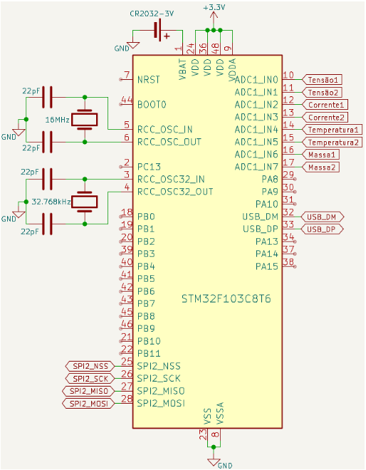

# Projeto Data Logger - Sistemas Embarcados 2
Projeto para Sistemas de Embarcados 2, visando a criação de um Data Logger.
IDE: STM32 Cube IDE. (necessário logar no STM32 Cube IDE e permitir instalações).  

Microprocessador STM32F103C8T6  

Informações completas sobre o circuito: "Circuitos/Relatório Data Logger.pdf"

