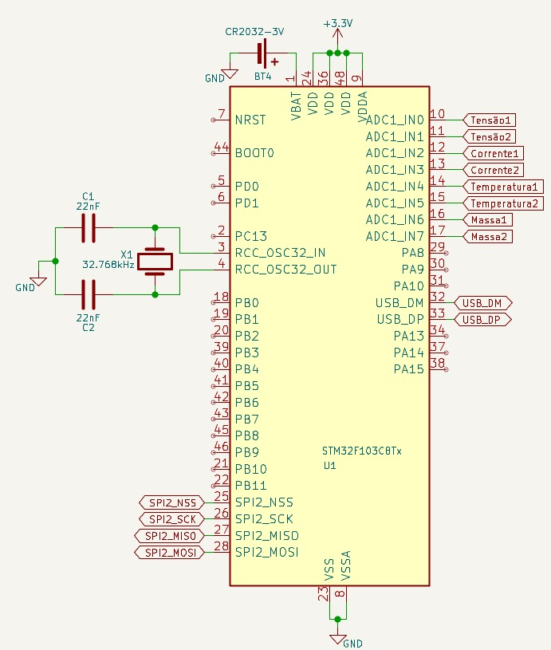

# Projeto Sistemas Embarcados 2
IDE utilizada STM32 Cube IDE. 
Necessário logar no STM32 Cube IDE e permitir instalações.  

Microprocessador STM32F103C8T6  

ADC12_IN0	Tensão1  
ADC12_IN1	Tensão2  
ADC12_IN2	Corrente1  
ADC12_IN3	Corrente2  
ADC12_IN4	Temperatura1  
ADC12_IN5	Temperatura2   
ADC12_IN6	Massa1  
ADC12_IN7	Massa2  

Amostre sinais de até 10kHz, isso significa que precisam ser 20 mil amostras por segundos pra ter um sinal confiável.  

Pra essa amostragem acredito que teria que usar DMA pra armazenar os dados em um buffer e depois executar a conversão e salvar no SD.  

220V PICO

Configurar o micro para usar DMA para leitura dos canais ADC.  
Conversão de counts para unidade de engenharia ao gravar no micro SD.  

O cristal no pino 3 e 4 é pra viabilizar o RTC interno, junto com a bateria no pino 1 que mantém o tempo salvo ao desligar. A interface USB está sendo feita diretamente pela porta do STM mesmo, no SPI está o cartão SD.  

O SD por ser compatível com SPI e o STM trabalhar em 3.3V, pode ser ligado diretamente sem uso de CI.  

Pra leitura de temperatura ficou assim os dois canais, depois vou detalhar melhor o funcionamento e mandar aqui, mas basicamente consegui pensar em um circuito que seja genérico para todas as grandezas, alterando apenas os ganhos pra cada um.  

Medidor de massa ADS1232.  

E de temperatura circuito genérico.  

USB recebe dados para configurações.  
Quantos dados o SD consegue processar por GB.
Implementar filtro passa-baixa digital.

